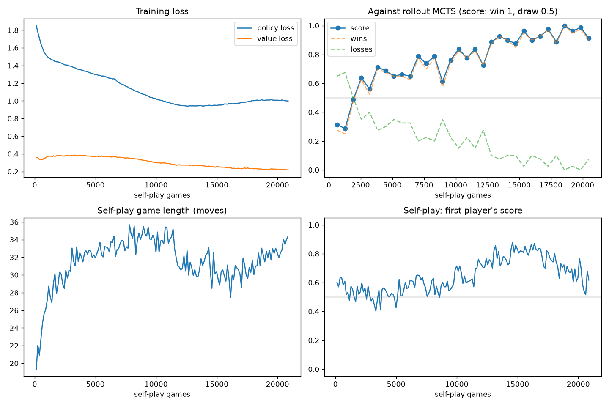

# Connect Four + AlphaZero-style Search

This is a small Connect Four engine and training loop in Rust + Python. It uses MCTS, policy/value learning, and lightweight self-play.

It is inspired by AlphaGo Zero (Silver et al 2017), but it is not a faithful reimplementation of the paper. The game is Connect4 not Go, the model is intentionally kept small, and the search / training setup is simpler so it can run on a CPU over a few hours.



Roughly:
1. Rust checks legal moves and board state in `crates/connect4`.
2. Self-play generates training positions across the Rust/Python boundary.
3. Python trains the policy/value network from those positions.

To play the saved checkpoint, run:

```bash
python python/play_gui.py runs/connect4/checkpoint.pt
```

To train on new runs, create a conda env and run (set args as desired):

```bash
python python/train.py --out runs/connect4
```
 
